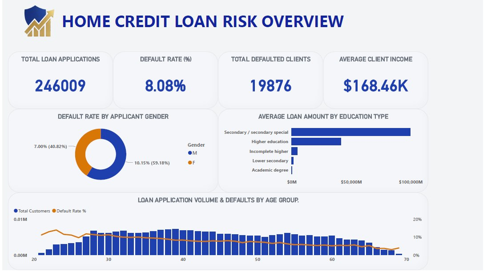
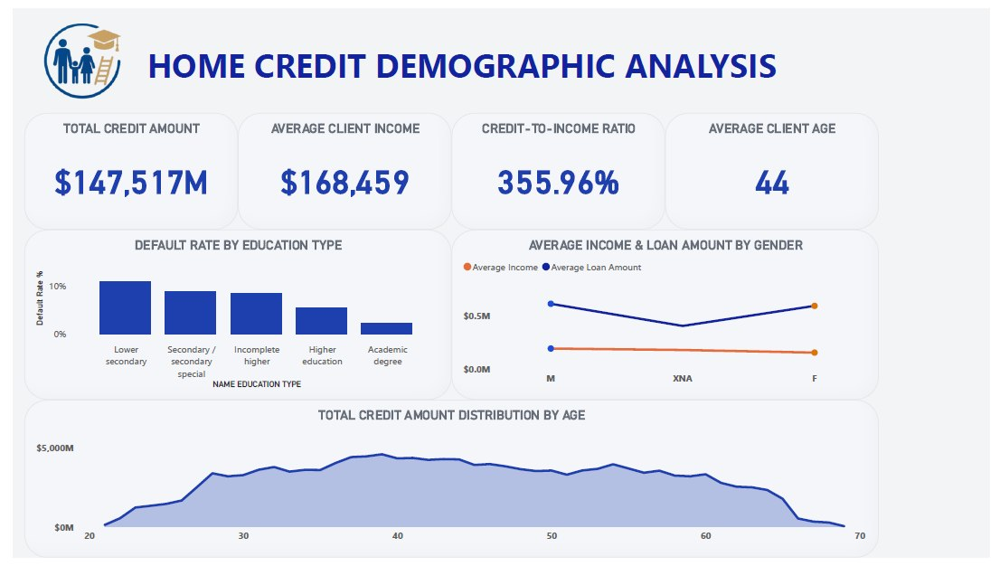
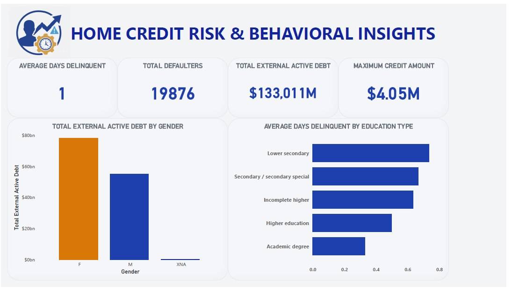

# Home Credit Loan Risk & Behavioral Dashboard 💳📊

📌 **Project Overview**  
An end-to-end Credit Risk & Behavioral Analytics project built using the Home Credit dataset to understand borrower characteristics, identify patterns associated with loan default, and translate those patterns into actionable risk-management opportunities.

The objective was not simply to report the number of defaults, but to answer three key business questions:
1. **Who represents the highest-risk segments?**
2. **What financial and demographic patterns are associated with higher delinquency and default?**
3. **How can these insights support better credit-risk decisions?**

The analysis combines **Python, Power BI, Power Query, and DAX** to transform raw loan application data into an interactive risk analytics solution.

---

## 🖼️ Dashboard Preview

<p center">
  
</p>

---

## 📊 Portfolio Overview
The analyzed portfolio contains approximately **246K loan applications** with an overall default rate of:

> **8.08% Default Rate**

This means that while the majority of applications are performing successfully, a meaningful portion of the portfolio carries credit risk that requires closer monitoring. The dashboard therefore focuses on understanding where that risk is concentrated and what characteristics distinguish higher-risk borrowers.

---

## 🔎 Key Findings & Business Insights

### 1️⃣ Default Risk Is Not Evenly Distributed
The overall default rate of 8.08% provides a useful portfolio benchmark, but portfolio-level averages can hide important differences between borrower segments. When we break the portfolio down by demographic and financial characteristics, risk patterns become more visible.

💡 **Business Opportunity:**  
Instead of applying the same credit strategy to every applicant, lenders can use risk segmentation to identify higher-risk groups and apply more targeted assessment and monitoring:
* More detailed affordability checks for higher-risk segments.
* Risk-based pricing where appropriate.
* Additional monitoring after loan approval.
* More conservative exposure limits for higher-risk profiles.

---

### 🎓 2️⃣ Education Level Shows a Noticeable Risk Pattern
The analysis revealed that borrowers with lower secondary education levels tend to show higher delinquency patterns compared with borrowers holding academic degrees. This does not mean education itself causes default; instead, education level may act as a proxy for other socioeconomic or financial factors.

💡 **Business Opportunity:**  
Risk teams could combine education with other variables:
`Income` ➔ `Credit-to-Income Ratio` ➔ `Employment` ➔ `Previous Delinquency` ➔ `Loan Exposure`

---

### 💰 3️⃣ Credit-to-Income Ratio Is an Important Risk Signal
One of the strongest behavioral patterns identified in the analysis is the relationship between higher credit-to-income ratios and increased default risk. When a borrower's credit exposure becomes large relative to their income, their financial capacity to absorb additional repayment obligations may become more constrained.

<p center">
  
</p>

💡 **Business Opportunity:**  
* Flagging applications with unusually high credit-to-income ratios.
* Performing additional affordability checks.
* Limiting exposure for higher-risk profiles.

---

### ⏱️ 4️⃣ Delinquency Provides an Early Warning Signal
The dashboard analyzes **Average Days Delayed** to understand borrower payment behavior. Delinquency provides an early indication of financial stress before a borrower reaches a more severe credit-risk stage.

💡 **Business Opportunity:**  
`Increasing Delays` ➔ `Risk Alert` ➔ `Customer Review` ➔ `Early Intervention`

---

### 💳 5️⃣ External Active Debt Adds Another Layer of Risk
Borrowers may have financial obligations outside the current loan portfolio. Tracking **Total External Active Debt** provides additional context when evaluating a borrower's overall financial exposure.

---

## 📊 Dashboard Structure

| View | Screenshot | Focus Area |
| :--- | :---: | :--- |
| **1. Loan Risk Overview** | *(Top Section)* | Executive summary of applications, default rate, income levels, and KPI indicators. |
| **2. Demographic Analysis** |  | Breakdown of age, gender, education level, and credit-to-income performance. |
| **3. Risk & Behavioral Insights** |  | Analysis of days delayed, total external debt, and deep-dive financial exposure. |

---

## 🎯 From Insights to Risk Strategy
1. **Risk-Based Segmentation:** Move from a one-size-fits-all approach toward segment-based risk assessment.
2. **Early-Warning Systems:** Use delinquency behavior and exposure metrics to intervene early.
3. **Affordability Assessment:** Evaluate income, credit exposure, and external debt together.
4. **Portfolio Monitoring:** Track default trends continuously across demographic and behavioral segments.

---

## 🛠️ Technical Implementation

### **Python – Data Cleaning & Engineering**
* Missing-value handling & duplicate detection
* Data-type standardization & feature integration
* Integration of household and child-count variables into the analytical pipeline

### **Power Query & Data Modeling**
* Structured analytical data model to support dynamic filtering and multi-dimensional analysis.

### **DAX Measures Developed**
* `Default Rate %`
* `Average Days Delayed`
* `Maximum Credit Amount`
* `Total External Active Debt`

---

## 📂 Repository Structure

```text
Home-Credit-Risk-Analysis/
│
├── Dashboard/
│   └── Credit_Risk_Data.pbix
│
├── Screenshots/
│   ├── photo_5765035018769078581_y.jpg
│   ├── photo_5765035018769078582_y.jpg
│   └── photo_5765035018769078583_y.jpg
│
├── PDF/
│   └── Home_Credit_Risk_Report.pdf
│

└── README.md
